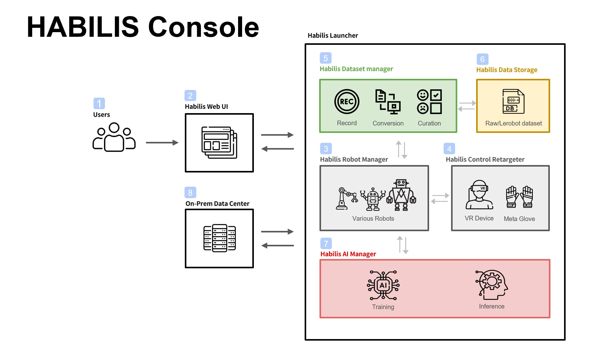

 

  <strong>하빌리스 콘솔이란</strong> 

 

🌏️ 휴머노이드 로봇이 데이터를 수집하고, 변환하고, 학습하고, 현실에서 실행하기까지 전 과정을 견고하게 구성된 파이프라인으로 연결하여 제공하는 휴머노이드 학습용 소프트웨어 생태계입니다.

“로봇을 학습시키는 일”은 더 이상 연구실의 복잡한 파이프라인과 스크립트 더미에 국한되지 않습니다.
휴머노이드 로봇으로 데이터를 수집하고, 의미 있는 학습 자산으로 변환되고, AI로 학습되며, 다시 현실 세계에서 실행되기까지—흩어져 있던 전 과정을 하나로 엮어 하빌리스 콘솔은 “ 처음부터 끝까지 도달하는” 학습 생태계를 제공합니다.

하빌리스 콘솔은 다양한 로봇을 붙이고, 다양한 장치를 붙이고, 다양한 환경에서 반복 실험을 해도 파이프라인의 중심은 흔들리지 않도록 설계 되었습니다. 우리는 “지금 로봇” 그리고 “다음 로봇”을 생각합니다. 

하빌리스 콘솔은 로봇 학습 분야에서 가장 인기있는 포맷 중 하나인 LeRobot 데이터 포맷으로의 변환을 기본 기능으로 제공합니다. 통일된 데이터 형식은 실험의 재현성과 공유 가능성이 올라가고, 팀과 커뮤니티의 속도가 빨라집니다. 데이터가 통일되는 순간, 성장이 시작됩니다.

하빌리스 콘솔의 숨은 매력은 사용 경험의 배려에 있습니다.
로봇을 잘 모르는 사람도, AI 학습을 잘 모르는 사람도, 코드로 모든 걸 다룰 필요 없이 GUI에서 로봇을 연결하고 제어하고 데이터를 기록할 수 있습니다. 버튼 하나로 기록을 시작하고, 세션을 관리하고, 수집물을 확인하고, 필요한 변환과 큐레이션까지 이어지는 흐름은 사용자의 실수를 줄이고, 반복을 쉽게 만들고, 팀의 확장을 수월하게 합니다.경험이 없어도 실험에 집중할 수 있어야 하니까요.

우리는 결국 이런 약속을 합니다.
로봇 학습의 여정이 더 이상 끊기지 않도록—데이터에서 모델로, 모델에서 현실로 이어지는 길을 단단하게 만들고,
어떤 로봇이든, 누구든 쉽게, 그리고 팀이 함께 빠르게 달릴 수 있도록.

현장에서 얻은 움직임과 의도를, 학습 가능한 미래의 능력으로 바꾸는 도구.
그것이 저희가 제공하고싶은 휴머노이드 학습용 소프트웨어 생태계입니다.